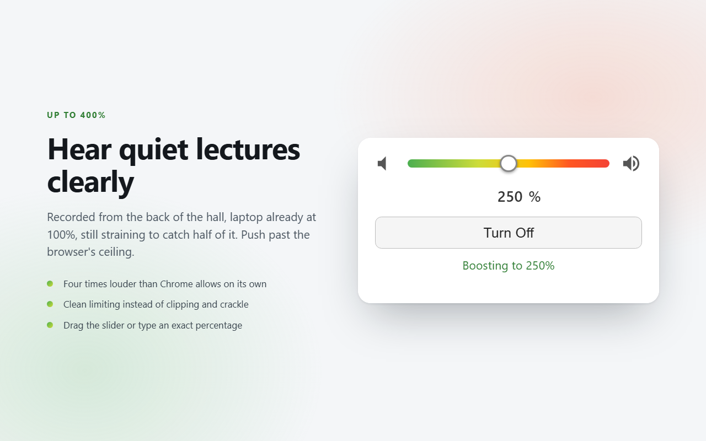
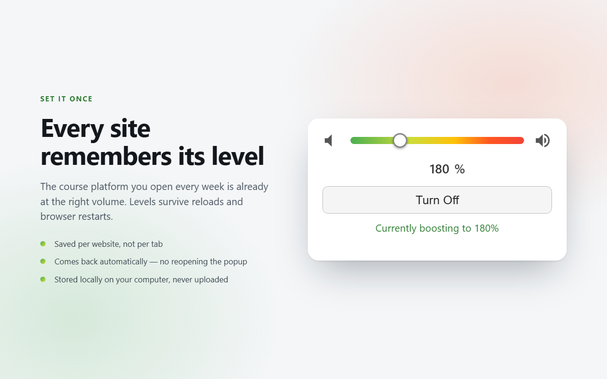
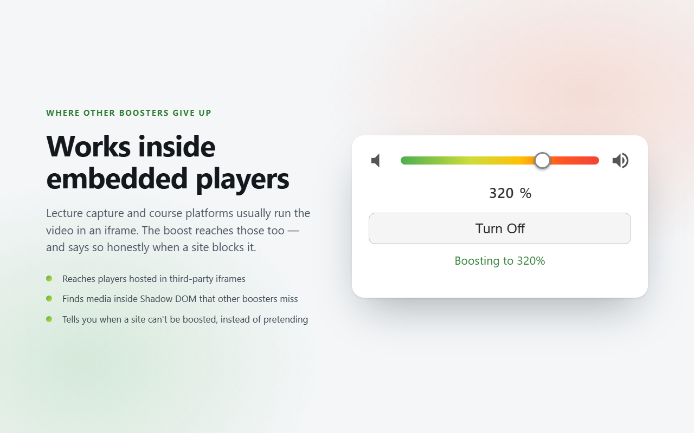

# KAM Volume Booster

**Hear quiet lectures clearly.** A Chrome extension that boosts audio and video
in any tab up to 400%, which is four times past what Chrome will do on its own.

I built this because half my lecture recordings are too quiet to actually
follow. Mic at the back of the hall, laptop already maxed out, still straining
to catch every other word. It works just as well on badly mastered uploads and
quiet calls, but quiet coursework is the thing I tuned it for.

The catch with boosting audio is that if you just turn the gain up you clip it
into crackle, which is the last thing you want when you're trying to make out
speech. So this runs a proper mastering-style chain instead: soft clipping, a
brick-wall limiter, and processing that scales with how hard you push it, so
small boosts still sound untouched.

---

## Install (unpacked)

1. Clone or download this repo.
2. Go to `chrome://extensions`.
3. Turn on **Developer mode**.
4. **Load unpacked** → select the repo folder.

No build step. The source is what ships.

## Use

Click the toolbar icon, drag the slider (or type a percentage). The boost is
remembered **per site** and comes back automatically on reload and after a
browser restart. **Turn Off** returns the site to 100%.

Embedded players are covered too. Lecture-capture and course platforms usually
run the video in an iframe, and media inside Shadow DOM defeats most boosters —
both work here. When a site genuinely can't be boosted, the popup says so
instead of pretending.

---

## How it works

`content.js` runs in every frame and routes each `<audio>` / `<video>` element
through a Web Audio graph:

- **Subsonic high-pass** (25 Hz, Q 0.707) — strips inaudible rumble that would
  otherwise eat limiter headroom.
- **Gain** — the boost multiplier.
- **Soft-clip WaveShaper** (tanh, 4× oversampled) — rounds peaks so overshoot
  saturates smoothly instead of hard-clipping into crackle.
- **Limiter** (`DynamicsCompressor`, knee 3, ratio 20, 3 ms attack) — brick-wall
  peak control.
- **Makeup gain** — restores headroom lost to limiting.

### Level-dependent processing

The limiter threshold and makeup gain scale with the boost, so the chain isn't
uniformly "processed" at every setting:

| Boost | Limiter threshold | Makeup | Character |
|---|---|---|---|
| ~110–150% | ≈ 0 dBFS (idle) | 1.0× | near-transparent wire |
| 400% | −2 dB | 1.1× | limiter progressively in control |

All parameters ramp on a 10 ms time constant — below perception, but enough to
prevent zipper noise when the slider is dragged or jumped.

### Finding the media

Three mechanisms, because no one of them is sufficient:

1. **MutationObserver** — elements added after load (SPA navigation).
2. **Recursive scan** — descends into open Shadow DOM roots. Runs once per frame;
   the observer covers everything after.
3. **Capture-phase `play` listener** using `event.composedPath()[0]` — catches
   media inside custom web components that `querySelectorAll` can't reach. This
   is what makes Shadow-DOM-heavy players work.

---

## Measured characteristics

Numbers from `OfflineAudioContext` impulse and render benchmarks at 48 kHz, not
estimates.

### Latency: ~10 ms

| Stage | Delay |
|---|---|
| WaveShaper `oversample: "none"` | 0 samples |
| WaveShaper `oversample: "2x"` | 128 smp — 2.67 ms |
| WaveShaper `oversample: "4x"` | 192 smp — 4.00 ms |
| **Full chain** | **480 smp — 10.05 ms** |

The 288 samples beyond the shaper are `DynamicsCompressorNode`'s internal
lookahead — 6.0 ms, fixed, and not configurable in Chrome. The total is constant
(it doesn't drift) and sits under the usual ~20 ms threshold for noticing
audio/video desync.

**Consequence for contributors:** no part of this graph is sample-aligned with
unprocessed audio. Don't add a dry "bypass" path and crossfade to it — the two
paths are 10 ms apart and it flanges audibly.

### CPU: ~1% of one core

| Configuration | Cost | vs. untouched |
|---|---|---|
| Untouched audio | 0.039% of a core | 1× |
| Gain only | 0.049% | 1.3× |
| Full chain, shaper `4x` | **0.973%** | 25× |
| Full chain, shaper `2x` | 0.591% | 15× |
| Full chain, shaper `none` | 0.418% | 11× |

The 4× oversampled shaper dominates. The limiter is only ~0.11%.

A page that is never boosted **never constructs an AudioContext at all**, so
this cost applies only to tabs actually being boosted.

Other measured overheads, for anyone tempted to optimise them: the
MutationObserver callback costs **0.76 µs per added node** (a page inserting
21,000 nodes costs 6.8 ms total), and the one-time full-document scan costs
**2.6 ms at 20,000 elements**. Both are already negligible.

---

## Known limitations

**CORS-restricted media can't be boosted.** A cross-origin media resource whose
element isn't CORS-enabled makes `MediaElementAudioSource` output *silence*, not
just un-boosted audio. The extension detects this and deliberately skips wiring,
so playback stays normal, and the popup tells you it happened. This is a browser
security rule, not a bug — it can't be worked around from an extension.

**Other extensions' pages can't be boosted.** Chrome forbids content-script
injection into `chrome-extension://` pages belonging to other extensions.

**Restricted pages.** `chrome://`, `about:`, `view-source:` and the Web Store are
off-limits to all extensions; the popup says so instead of failing silently.

---

## Approaches deliberately rejected

Recorded so they don't get re-litigated:

- **`tabCapture` + offscreen document** — wrong tool. Designed for
  recording/streaming, mutes the source tab unless re-output, needs an offscreen
  document. The content-script model is correct here.
- **Lookahead limiting** — lookahead *is* latency.
- **Multiband limiting** — crossover filters add phase shift and group delay;
  doing it transparently needs lookahead-style compensation.
- **High-shelf "air" EQ** — implemented, then reverted. It amplified existing
  hiss and lossy-compression artifacts, which read as harshness.
- **True-peak / oversampled limiting** — `DynamicsCompressorNode` can't
  oversample; doing it properly needs an `AudioWorklet`, which adds latency. The
  4× oversampled shaper already absorbs most inter-sample overshoot.
- **Dry bypass path with crossfade** — see the latency table above.
- **Dynamic content-script registration** (registering only for boosted origins)
  — content script `matches` are tested against each *frame's* URL, so a player
  in a third-party iframe would stop auto-restoring.
- **All-tabs control / global mute, EQ controls** — not worth the complexity for
  a volume booster.

---

## Architecture notes

| File | Role |
|---|---|
| `manifest.json` | MV3 manifest |
| `config.js` | Single source of truth for the boost ceiling and storage keys; loaded by all three contexts |
| `content.js` | Audio processing and element discovery |
| `background.js` | One listener: resolves a subframe's tab origin when the frame can't |
| `popup.*` | UI |

**Shared config.** `config.js` is loaded by the popup (`<script>`), the content
script (manifest, before `content.js`) and the worker (`importScripts`). The
popup sets its slider bounds from it at runtime, so the ceiling has exactly one
definition and can't drift out of sync with the audio tuning.

**Persistence.** Boosts are stored in `chrome.storage.local` keyed by origin.
100% is stored as *absence* of a key, so storage doesn't accumulate an entry per
site ever visited.

**Restore is pull, not push.** The content script asks for its tab's boost at
`document_start` rather than the worker pushing on `tabs.onUpdated` — no frame
enumeration, no race against script readiness, and iframes created later ask on
their own behalf. Frames resolve the tab's origin themselves via
`location.ancestorOrigins`, so the service worker doesn't start at all on a
normal page load; it's a fallback for sandboxed frames with an opaque origin.

**Honest status reporting.** Each frame returns raw tallies
(`{wired, cors, failed}`) rather than a verdict, and the popup sums them across
frames. A frame that found nothing therefore can't mask a frame that succeeded.

---

## How this was built

I built this with Claude Code and I've left the `Co-Authored-By` trailers in the
commit history on purpose. I want to work in AI engineering, so hiding that I
build things with models would be a weird place to start.

How it actually worked: I set the constraints and decided what counted as good
enough, the model wrote most of the code, and I tested everything by ear and told
it what I was really hearing. The one rule was that nothing about audio quality
or performance stayed in unless there was a number behind it.

That rule is the reason this was worth doing, because a lot of what we both
assumed turned out to be wrong.

The whole project was built on "zero added latency, non-negotiable". Then we
actually measured it. The chain was already sitting at 10.05 ms, and 6.0 ms of
that was `DynamicsCompressorNode` doing its own internal lookahead, which is the
exact thing the rule existed to ban. So the constraint had been driving design
decisions the whole time and nobody had ever checked it was true.

Same thing happened with an optimisation I was sold on. We built a bypass path to
save CPU while the boost is off, measured it, and the two paths turned out to be
10 ms apart, so crossfading between them flanges. It got deleted before it
shipped. The reason is written into `content.js` so I don't just build it again
in six months.

One optimisation did nothing at all. A filter in the MutationObserver callback
that skips childless nodes benchmarked exactly the same as the version without
it, 0.76 µs per node either way, because the real cost is Chrome handing over the
mutation records and not the query. I kept the code and rewrote the comment. A
comment claiming a speedup that isn't there is worse than no comment.

The one I'm most glad we caught was only registering the content script on sites
you've actually boosted, so it stays off the rest of the web. That sounds
obviously good. But content script `matches` get checked against each frame's URL
and not the tab's, so a lecture player sitting inside an iframe would have
quietly stopped restoring its boost, and that's the main thing I built this for.

Two things I turned down on judgement rather than measurement. Suspending the
`AudioContext` when nothing is playing, because if you're not using it you just
turn the booster off. And `latencyHint: "playback"`, which saves CPU by doubling
output buffering to 20 ms, and that's not a trade I want on video.

## Privacy

No data collection, no analytics, no network requests. The only thing stored is
a number per origin (your chosen boost level), kept locally in
`chrome.storage.local`. See [PRIVACY.md](PRIVACY.md).

## License

[MIT](LICENSE)
