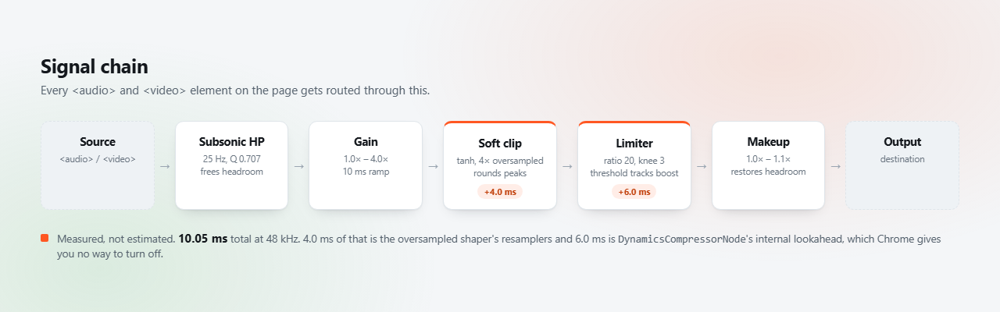

# Store assets

Source for the Chrome Web Store screenshots. Each frame is an HTML file that
renders at exactly **1280×800** — a valid Web Store screenshot size — and the
committed PNG next to it is the render.

The popup in each frame is the real markup from `popup.html` with the real
styles from `popup.css`, scaled up so it stays legible at listing size. Nothing
is mocked up or drawn to look better than it is: what the listing shows is what
ships.

## Regenerating

After any change to `popup.html` or `popup.css`, mirror it into
`promo/_shared.css` (the popup rules there are copied verbatim) and re-render:

```bash
"C:/Program Files/Google/Chrome/Application/chrome.exe" --headless --disable-gpu --hide-scrollbars --force-device-scale-factor=1 --window-size=1280,800 --screenshot=promo/shot-1-lectures.png promo/shot-1-lectures.html
```

Repeat per frame. `--force-device-scale-factor=1` matters: without it a HiDPI
display produces 2560×1600 output.

## Frames

| File | Angle | Used by |
|---|---|---|
| `shot-1-lectures` | The core pitch — quiet lecture recordings | Store, README hero |
| `shot-2-remembers` | Per-site memory across reloads and restarts | Store, README |
| `shot-3-embedded` | Iframe and Shadow DOM players, honest status | Store, README |
| `signal-chain` | The audio graph with measured per-stage latency | README only |

`signal-chain` is 1280×400 rather than 1280×800 — it's a README banner, not a
store screenshot, so don't upload it to the listing.



## Still missing

A **440×280** small promo tile, if you want better placement in the store.
